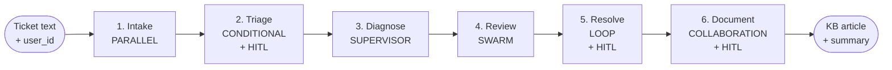
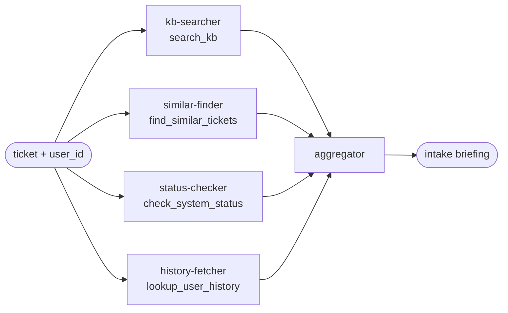
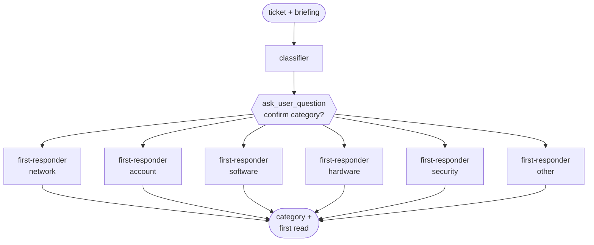
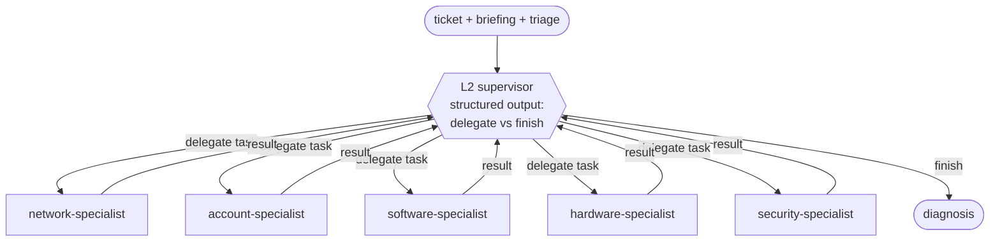
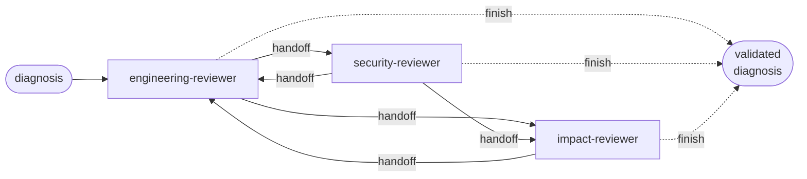
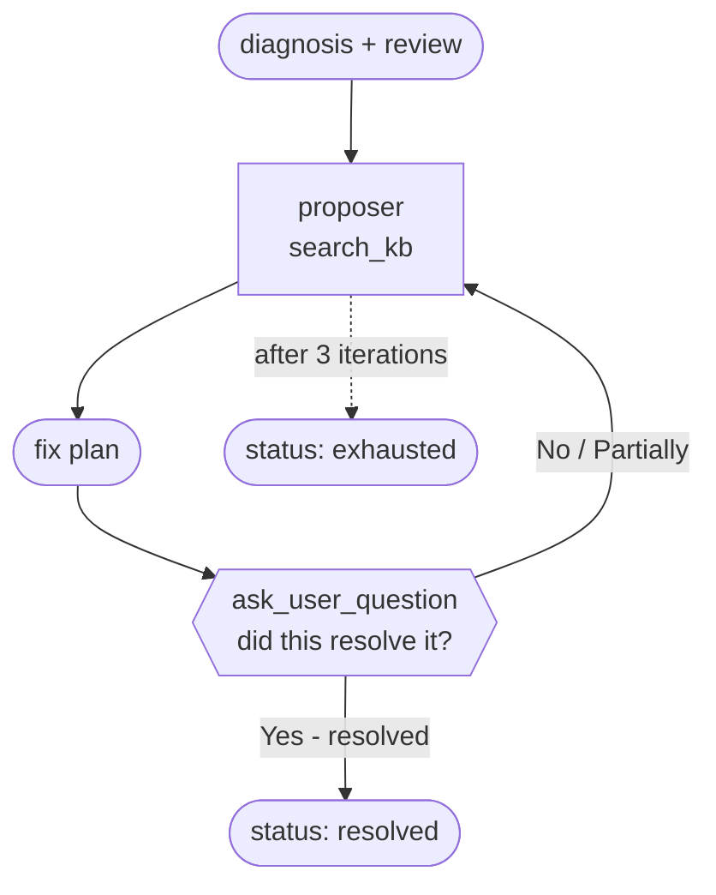
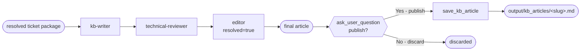

# Agentic Engineering 01: AI Service Desk on the Claude Agent SDK

A single end-to-end demo of an IT service desk that resolves a user-reported
ticket through six stages, with each stage exercising exactly one of the
required orchestration patterns. The outer pipeline is itself the **sequential**
workflow, so all 7 patterns from the assignment are covered:

| Stage | Pattern | File | What happens |
|---|---|---|---|
| 1. Intake | **Parallel** workflow | `stage_intake.py` | 4 specialist gatherers (KB, similar tickets, system status, user history) run concurrently; an aggregator agent fans them in into a briefing. |
| 2. Triage | **Conditional** workflow + HITL | `stage_triage.py` | A classifier labels the ticket; the user confirms or overrides via `ask_user_question`; the workflow branches to one of 5 first-responder agents. |
| 3. Diagnose | **Supervisor** multi-agent | `stage_diagnose.py` | An L2 lead supervisor delegates investigation to specialist subagents (network, account, software, hardware, security) using structured-output decisions. |
| 4. Review | **Swarm** multi-agent | `stage_review.py` | Three peer reviewers (engineering, security, impact) hand off the diagnosis among themselves until one of them finishes the review. |
| 5. Resolve | **Loop** workflow + HITL | `stage_resolve.py` | Propose a fix -> ask the user `Did this work?` -> refine on user feedback. Max 3 iterations. |
| 6. Document | **Collaboration** multi-agent + HITL | `stage_document.py` | Writer -> technical reviewer -> editor compose a KB article in fixed sequence; the user approves publication; `save_kb_article` persists the article. |
| (outer)| **Sequential** workflow | `main.py` | Drives stages 1 -> 6 in order, each stage's output feeds the next. |

Human-in-the-loop runs through the same primitive used in the prior
`01-python-skript-pro-llm-api` project: a numbered menu with an
auto-appended "Other" entry. The orchestrator calls it directly between
stages, and it is also exposed as an MCP tool so any agent can poll the
user mid-conversation when it needs a clarification.

## Architecture

### Pipeline at a glance (sequential outer workflow)



### Stage 1 - Intake (parallel: fan-out / fan-in)



### Stage 2 - Triage (conditional + HITL)



### Stage 3 - Diagnose (supervisor + specialist subagents)



Specialists share `search_kb`, `find_similar_tickets`, `check_system_status`,
and `lookup_user_history` so they can investigate; the supervisor itself
carries no tools and only routes via structured output.

### Stage 4 - Review (swarm of peer reviewers)



Each reviewer decides on every turn (via structured output) whether to hand
off to one of its declared peers or to finish the chain. There is no
hierarchy; entry point is `engineering-reviewer`.

### Stage 5 - Resolve (loop with the user as the evaluator)



The reference loop pattern uses an LLM evaluator; this demo substitutes the
user, which is more honest for a helpdesk scenario.

### Stage 6 - Document (collaboration + HITL publish gate)



Each author runs in its own isolated `ClaudeSDKClient` session and emits
structured output `{resolved, content}`. The editor sets `resolved=true` to
end the chain.

## Prerequisites

- Python >= 3.10
- [`uv`](https://docs.astral.sh/uv/) for env and dependency management
- The Claude Code CLI installed and on `PATH` (the SDK shells out to it)
- An Anthropic API key

## Setup

```shell
cp .env.example .env          # then put your ANTHROPIC_API_KEY into .env
rm -rf .venv && uv venv && uv sync
```

## Run

```shell
uv run main.py
```

That uses the bundled sample ticket (a VPN-after-2FA timeout that maps neatly
into the seed data under `data/`). To drive your own scenario:

```shell
uv run main.py "Outlook keeps crashing when I open the shared finance workbook" u-petra
```

The first positional argument is the ticket text, the second is the user id
(default `u-default`, which has matching seed history). The pipeline will
pause at HITL checkpoints in stages 2, 5, and 6 and ask you to pick from a
numbered menu - just type a number.

## Expected output (abbreviated)

```
######################################################################
AI SERVICE DESK - End-to-end ticket lifecycle
######################################################################
Ticket  : Hi, since this morning I cannot sign in to the corporate VPN ...
User    : u-default

========================================================================
STAGE 1: INTAKE  [PARALLEL workflow]
========================================================================
  [kb-searcher]    starting...
  [similar-finder] starting...
  [status-checker] starting...
  [history-fetcher] starting...
  ...
--- INTAKE BRIEFING ---
Auth gateway is currently degraded. KB-003 and ticket T-1006 describe an
identical "VPN connection timed out after 2FA" pattern resolved by ...

========================================================================
STAGE 2: TRIAGE  [CONDITIONAL workflow + HITL]
========================================================================
--- CLASSIFIER OUTPUT ---
CATEGORY: network. Symptoms point to VPN/auth path failure.

[ask_user_question] I classified this ticket as 'network'. Confirm or override?
  1. network
  2. account
  3. software
  4. hardware
  5. Other (type your own answer)
Select an option number: 1
  Confirmed category: network
  ...
```

The full run prints stage banners, structured-output decisions, MCP tool
calls, and finally a one-block summary of category, resolution status, and
the saved KB article path.

## How it works

`main.py` runs each stage in order and threads outputs forward. Each stage
file is self-contained and follows the canonical SDK pattern from the trainer
reference repo (`5_Claude_Agent_SDK/python/`):

- **Parallel** uses `anyio.create_task_group()` for fan-out and a synthesis
  agent for fan-in.
- **Conditional** parses a classifier's text output, gates with HITL, then
  dispatches to a category-specific first-responder.
- **Supervisor** loops `query()` calls with `output_format=json_schema` so
  the supervisor can return structured `delegate | finish` decisions.
- **Swarm** does the same but with a peer handoff graph instead of a
  hierarchy.
- **Loop** generates -> evaluates -> refines, where the user is the
  evaluator (via `ask_user_question`).
- **Collaboration** runs three peer authors in fixed order, each with its
  own isolated `ClaudeSDKClient`, output passed forward.

Custom helpdesk tools (`search_kb`, `find_similar_tickets`,
`check_system_status`, `lookup_user_history`, `save_kb_article`) and the
HITL primitive (`ask_user_question`) are registered on a single in-process
SDK MCP server in `mcp_server.py`. Each stage picks the subset of tools it
wants via `allowed_tools`.

## Project layout

```
.
├── main.py                # SEQUENTIAL outer pipeline
├── hitl.py                # ask_user_question (function + @tool wrapper)
├── tools.py               # @tool implementations over JSON-backed data
├── mcp_server.py          # builds the in-process MCP server, exports tool names
├── stage_intake.py        # PARALLEL workflow
├── stage_triage.py        # CONDITIONAL workflow + HITL
├── stage_diagnose.py      # SUPERVISOR multi-agent
├── stage_review.py        # SWARM multi-agent
├── stage_resolve.py       # LOOP workflow + HITL
├── stage_document.py      # COLLABORATION multi-agent + HITL
├── data/
│   ├── kb.json            # 8 KB articles
│   ├── tickets.json       # 10 historical tickets
│   └── status.json        # 7 internal services with current status
├── output/kb_articles/    # generated by stage 6 (gitignored)
├── pyproject.toml         # claude-agent-sdk, anyio, python-dotenv
├── .env.example           # template for ANTHROPIC_API_KEY
└── README.md
```

## Notes

- The default sample ticket is engineered so that the seed data (KB-003,
  T-1006, Auth=degraded) lines up with the symptom. That makes the demo
  reproducible end-to-end without you having to invent backing facts.
- `ask_user_question` validates 2-4 options, appends "Other", and returns
  `{"answer": str, "source": "option" | "other"}` - same contract as the
  prior `01-python-skript-pro-llm-api` project.
- KB articles produced by stage 6 land in `output/kb_articles/` and are
  gitignored. Delete the directory between runs if you want a clean slate.
- Costs are printed per-agent. A full run on `sonnet` typically lands in
  the low single-digit US-cent range.
